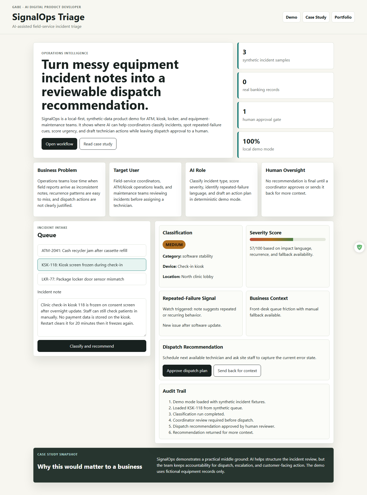
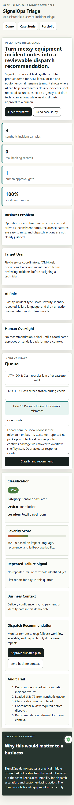

# SignalOps Triage

AI-assisted field-service incident triage with human-approved dispatch recommendations.

## Overview

SignalOps Triage is a standalone product demo for operations teams that review ATM, kiosk, locker, or equipment-maintenance incidents. It turns a synthetic incident note into a classification, severity score, repeated-failure signal, dispatch recommendation, and audit trail.

The app runs entirely in the browser and uses deterministic demo logic. It does not require a paid AI API key.

## Business Problem

Field-service coordinators often receive messy notes from sites, call centers, or internal teams. Those notes can make it hard to decide urgency, identify recurrence, and explain why a technician should be dispatched.

## Target Users

- Operations coordinators
- Field-service dispatch leads
- ATM, kiosk, locker, or equipment-maintenance teams
- Hiring managers reviewing applied AI workflow product thinking

## Product Approach

SignalOps demonstrates an AI-assisted decision-support workflow without pretending to autonomously control critical equipment. The system drafts a recommendation, but a human must approve or reject it.

## Main Features

- Synthetic incident queue
- Editable incident note intake
- Incident classification
- Severity scoring
- Repeated-failure detection
- Dispatch recommendation
- Human approval or rejection
- Audit trail

## Product Walkthrough

1. Select a synthetic incident from the queue.
2. Review or edit the incident note.
3. Click `Classify and recommend`.
4. Inspect severity, recurrence, and dispatch reasoning.
5. Approve the dispatch plan or send it back for more context.

## Screenshots

Desktop approved workflow:



Mobile workflow:



## Live Demo

After GitHub Pages is enabled, the demo will be available at:

`https://jubjub-cpu.github.io/signalops-triage/`

Local fallback:

Open `index.html` directly in a browser.

## AI Capability

The demo simulates AI-style workflow support:

- Classifies the incident type.
- Scores severity from impact, recurrence, and fallback language.
- Identifies repeated-failure cues.
- Drafts a dispatch recommendation.
- Keeps an audit trail of review actions.

## Human Oversight

No recommendation is final until a coordinator approves it. The product is framed as decision support, not autonomous dispatch.

## Architecture

```text
index.html
assets/
  app.js
  styles.css
data/
  synthetic-incidents.json
docs/
  CASE_STUDY.md
  RELEASE_NOTES.md
tests/
  validate.ps1
tools/
  static-server.mjs
  static-server.ps1
```

## Technology Stack

- HTML
- CSS
- Vanilla JavaScript
- PowerShell validation
- GitHub Pages-compatible static hosting

## Data and Privacy

All incidents are synthetic and fictional. The repository does not include real customer records, banking records, ATM transactions, payment-card data, employee records, private communications, credentials, or production logs.

## Local Setup

No build step is required. Open `index.html` in a browser.

Optional local server for browser testing. The helper uses Node.js from your PATH:

```powershell
Set-Location 'path\to\signalops-triage'
powershell -ExecutionPolicy Bypass -File .\tools\static-server.ps1 -Port 4174
```

Then open:

```text
http://127.0.0.1:4174/index.html
```

## Environment Variables

No environment variables are required. `.env.example` is included for optional future integrations. Do not commit real `.env` files.

## Testing

Run:

```powershell
Set-Location 'path\to\signalops-triage'
powershell -ExecutionPolicy Bypass -File .\tests\validate.ps1
```

## Deployment

Deploy from `main` using GitHub Pages with source `/`.

## Design Decisions

- Static browser app for simple review and deployment.
- Deterministic demo mode to avoid paid API dependencies.
- Human approval gate to keep the product responsible.
- Synthetic data only to protect privacy.

## Known Limitations

- Heuristic scoring is illustrative, not operationally validated.
- No live ticketing integration.
- No persistent database.
- No real AI API call in the default demo.

## Future Improvements

- Optional bring-your-own-key AI summaries.
- Exportable dispatch summary.
- CSV fixture import.
- More recurrence visualization.
- Browser-based accessibility checks.
